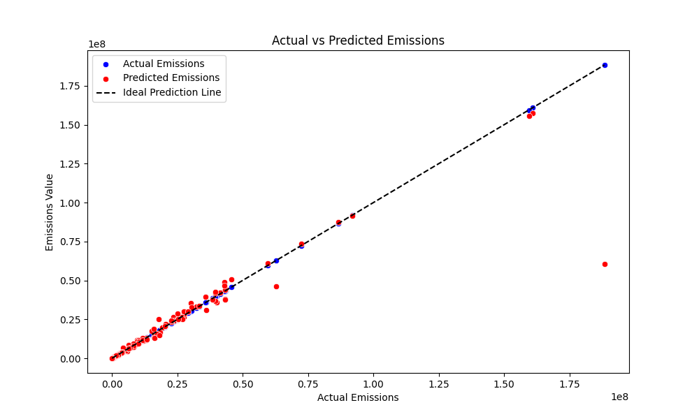
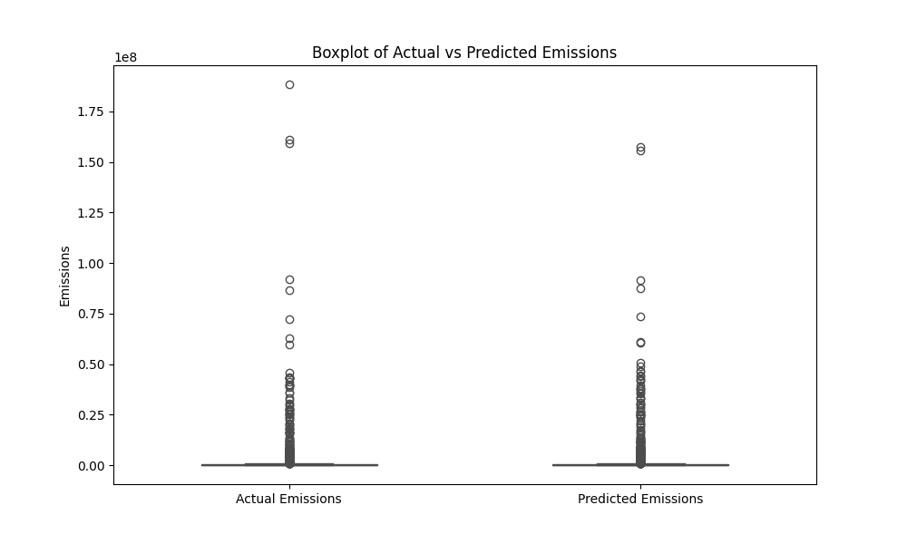
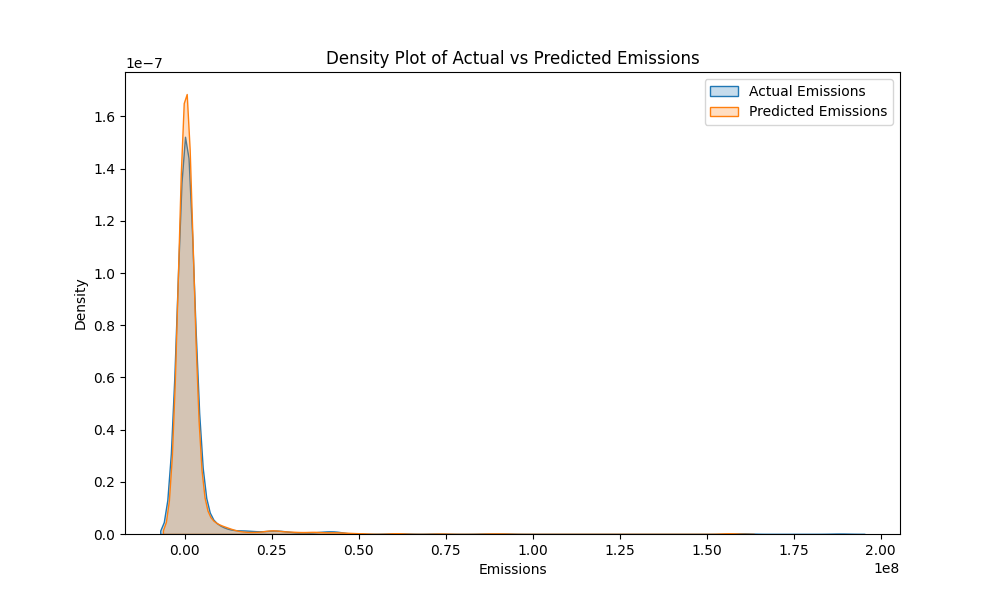
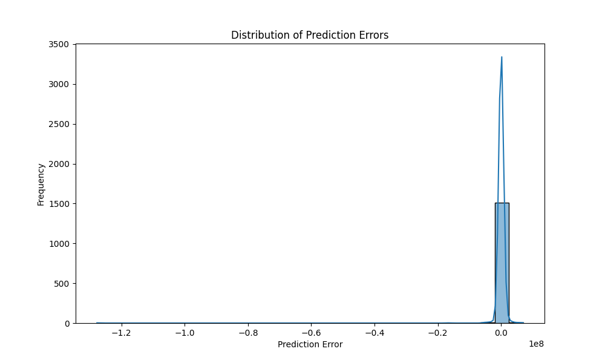
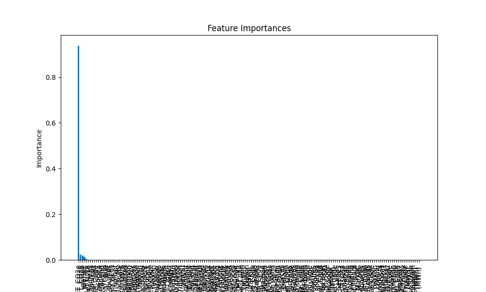

# Climate-Change-Risk-and-Opportunity-Analysis

A project to analyze and predict carbon emissions across organizations and sectors to enable targeted climate interventions.

## EmissionsImpact-Analyzer

### Overview

The EmissionsImpact-Analyzer is a machine learning project designed to assess carbon emissions across various organizations and sectors, enabling targeted interventions for climate change mitigation. This repository includes scripts for preprocessing data, selecting influential features, and training and evaluating models to predict emissions.

### Authors

- Anuj Patil
- Srideepthi Vootla

### Objective

To analyze and predict the carbon emissions of different organizations and sectors using machine learning techniques, providing a basis for informed climate change interventions.

### Methodology

#### Data Preprocessing

- **Categorical Encoding**: Transformed categorical variables into numerical formats using label encoding.
- **Normalization**: Applied MinMax scaling to ensure equal feature weighting.

#### Feature Selection

- **Lasso Regression**: Employed to retain the most influential features for predicting emissions.

#### Model Selection & Training

- **Random Forest Regressor**: Utilized for its robustness and suitability for regression tasks.
- **Hyperparameter Tuning**: Conducted via RandomizedSearchCV to find the optimal model parameters.

#### Validation

- **Data Split**: Employed an 80-20 split for training and testing to ensure model performance on unseen data.

### Key Findings

- **Model Performance**: Achieved high R-squared and low error metrics on both training and testing sets.
- **Top Emissions Contributors**: Identified the top companies and sectors with the highest predicted emissions.

### Results Visualization

Visual representations and analysis of predictions using multiple charts:

#### Scatter Plot
- The actual vs. predicted emissions scatter plot shows a high degree of alignment, especially for lower emission values.

#### Boxplot
- The boxplot comparing actual and predicted emissions indicates symmetry in spread and potential outliers.

#### Density Plot
- The density plot highlights the distribution overlap between actual and predicted emissions, suggesting model accuracy.

#### Error Distribution
- The error distribution histogram centers around zero, indicating no significant bias, but with a long tail suggesting underprediction in some cases.

#### Feature Importance
- Dominant features significantly influence the model's predictions, indicating potential key targets for interventions.

### Usage

To run the code in this repository, you will need Python 3 and the following packages:

- pandas
- numpy
- matplotlib
- seaborn
- scikit-learn

### How to Run

1. Clone this repository.
2. Install the required packages using `pip install -r requirements.txt`.
3. Run the script `emissions_analysis.py` to perform the analysis.

### Conclusion

The EmissionsImpact-Analyzer provides valuable insights into the carbon emission profiles of major organizations and sectors, aiding stakeholders in making data-driven decisions for climate change mitigation efforts. The analysis suggests the model performs well, particularly for lower emission values, with room for improvement in high-emission predictions.

### Future Work

- Explore sector-specific models.
- Incorporate additional data sources such as global temperature and economic indicators.
- Conduct a deeper analysis of prediction anomalies to refine the model.
- Enhance model's capabilities to improve accuracy and predictability.
